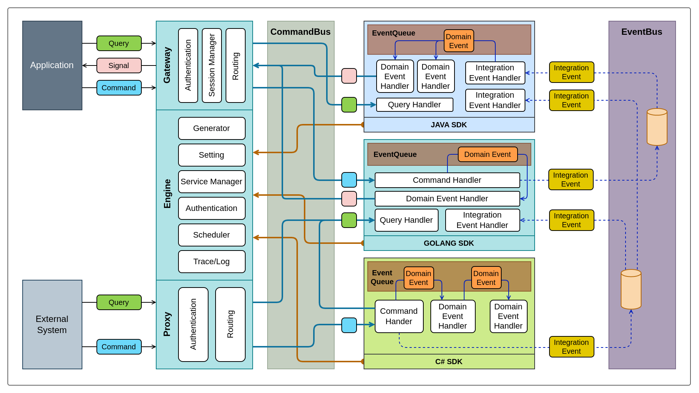

# Kiến trúc

Kiến trúc của Scyna được mô tả ở hình bên dưới

`Engine` là nới tập trung các logic cơ bản của core Scyna bao gồm:
- Setting: quản lý setting cho các module, mỗi module có một không gian trên Scyna để lưu trữ các tham số
- Generator: sinh ra mã duy nhất trong hệ thống gồm dạng số (`uint64`) hoặc dạng chuỗi 12 số cho các định danh kiểu serial number. 
- Module Manager: quản lý các module và các session của module đó. Mỗi module có thể có nhiều instance cùng hoạt động được gọi là các session
- Scheduler: lập lịch các tác vụ hoạt động theo thời gian như định kỳ gửi email, kích hoạt các job theo ngày,...
- Trace: quản lý các trace và các log gắn với các trace đó.