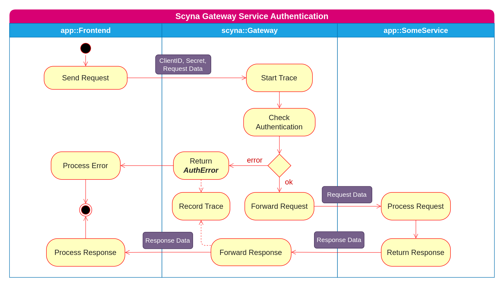

## Gateway

Giống như Proxy, Gateway là cổng vào cho các request xuất phát từ các ứng dụng (Frontend). Scyna hỗ trợ cơ chế xác thực cho người dùng cuối bằng một loại Endpoint đặc biệt là AuthService. Các ứng dụng có thể  linh hoạt xây dựng các cơ chế xác thực cho riêng mình bằng cách implement AuthServiuce của Application đó. Một AuthService có thể được sử dụng bởi nhiều Application. Đây cũng chính là cơ chế SSO cho các cho các Application. Luồng tạo một xác thực được mô tả như hình bên dưới

Khi một Authentication đã được tạo cho một người dùng nào đó rồi thì luồng xác thực sẽ được diễn ra như mô tả bên dưới

