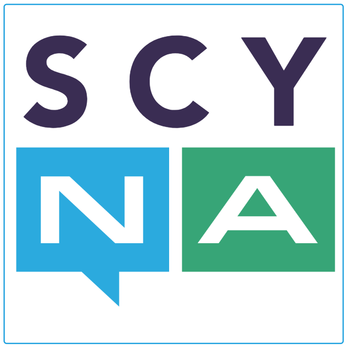
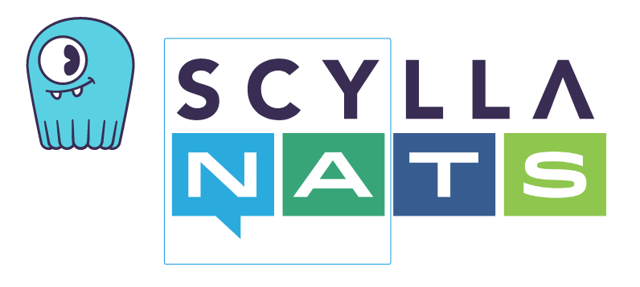

 

---

**SCYNA** là một nền tảng phát triển phần mềm dựa trên kiến trúc Microservice và Event-Driven. Scyna xuất phát từ một dự án phát triển nền tảng nội bộ (Internal Developer Platform) thuộc Vin3S để dùng cho một số hệ thống của VinFast. Dự án kết thúc với một số kết quả nhất định đủ đáp ứng nhu cầu nội bộ. Tuy nhiên, team phát triển nhận thấy dự án còn nhiều vấn đề có thể cải tiến và nó có thể rất hữu ích cho cộng đồng Developer nên đã thành lập một dự án mới dưới hình thức nguồn mở trên github (https://github.com/scyna) với mục đích xây dựng lại một nền tảng mới đơn giản hơn, gọn nhẹ hơn, tận dụng được khả năng generic mới được Golang release ở version 1.18. Nền tảng mới cũng hướng đến hỗ trợ SDK cho các ngôn ngữ lập trình thông dụng như Java, C#, Python, C++,...

Các module chính của Scyna được xây dựng bằng Golang, sử dụng NATS và ScyllaDB làm nền tảng giao tiếp và lưu trữ dữ liệu. Cái tên Scyna chính là được ghép của **SCY**lla và **NA**TS. Hiện tại Scyna hỗ trợ SDK cho 3 ngôn ngữ: Golang, Java và C#. Dự kiến SDK cho các ngôn ngữ Python, C++ và Rust sẽ được bổ sung trong thời gian tới.

Mục đích của Scyna là làm đơn giản hóa việc xây dựng các hệ thống phần mềm phân tán sử dụng Microservice và Event-Driven; tối ưu nguồn lực của doanh nghiệp khi có thể linh hoạt điều phối các developer có kỹ năng trên nhiều ngôn ngữ lập trình khác nhau; và hỗ trợ các khung kiến trúc tuân thủ Domain Driven Design, hỗ trợ mô hình phát triển Test Driven Developement. 