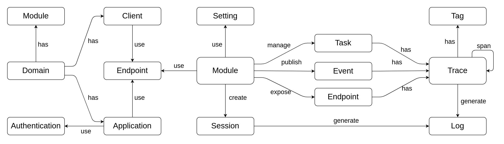

# SCYNA
--- 

Scyna là một nền tảng phát triển phần mềm dựa trên kiến trúc Microservice và Event-Driven. Scyna xuất phát từ một dự án phát triển nền tảng nội bộ (Internal Developer Platform) thuộc Vin3S để dùng cho một số hệ thống của VinFast. Dự án kết thúc với một số kêt quả nhất định đủ đáp ứng nhu cầu nội bộ, tuy nhiên team phát triển nhận thấy nó vẫn còn nhiều tiềm năng để phát triển nên đã quyết định viết lại toàn bộ theo một kiến trúc mới và opensource trên github (https://github.com/scyna).

Scyna được xây dựng bằng Golang, sử dụng NATS và ScyllaDB làm nền tảng giao tiếp và lưu trữ dữ liệu. Cái tên Scyna chính là được ghép của **Scy**lla và **NA**TS. Hiện tại Scyna hỗ trợ SDK cho 3 ngôn ngữ: Golang, Java và C#. Dự kiến SDK cho các ngôn ngữ Python, C++ và Rust sẽ được bổ sung trong thời gian tới.

Mục đích của Scyna là làm đơn giản hóa việc xây dựng các hệ thống phần mềm phân tán sử dụng Microservice và Event-Driven; tối ưu nguồn lực của doanh nghiệp khi có thể linh hoạt điều phối các developer có kỹ năng trên nhiều ngôn ngữ lập trình khác nhau; và hỗ trợ các khung kiến trúc tuân thủ Domain Driven Design, hỗ trợ phương pháp phát triển Test Driven Developement.

## A. Concepts

 

## B. Kiến trúc
 
 Kiến trúc của Scyna được mô tả ở hình bên dưới

#### Communication

[TODO]

#### Engine

[TODO]

#### Proxy

Proxy là cổng để kết nối các hệ thống bên ngoài với các service được implement trên Scyna. Đây thường là kết nối Backend-to-Backend và được xác thực bằng hai giá trị ***Client-ID*** và ***Secret***. Với mỗi cặp Client-ID/Secret, hệ thống sẽ được cấp quyền sử dụng một số Endpoint nhất định.

#### Gateway

Giống như Proxy, Gateway là cổng vào cho các request xuất phát từ các ứng dụng (Frontend). Scyna hỗ trợ cơ chế xác thực cho người dùng cuối bằng một loại Endpoint đặc biệt là AuthService. Các ứng dụng có thể  linh hoạt xây dựng các cơ chế xác thực cho riêng mình bằng cách implement AuthServiuce của Application đó. Một AuthService có thể được sử dụng bởi nhiều Application. Đây cũng chính là cơ chế SSO cho các cho các Application. Luồng tạo một xác thực được mô tả như hình bên dưới

Khi một Authentication đã được tạo cho một người dùng nào đó rồi thì luồng xác thực sẽ được diễn ra như mô tả bên dưới

#### SDK

