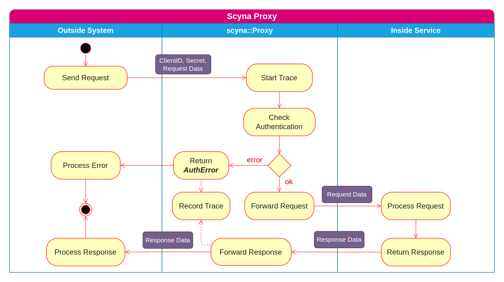
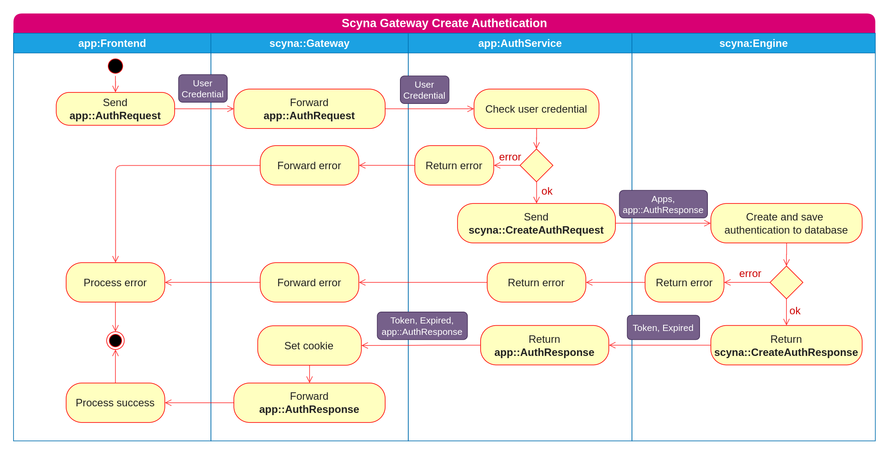
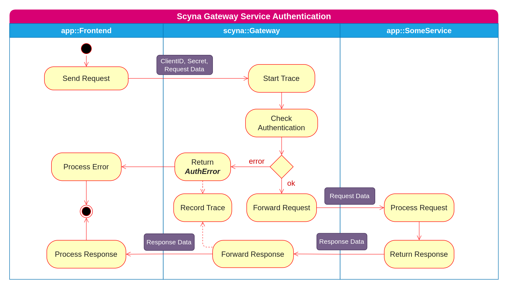

# SCYNA
--- 

Scyna là một nền tảng phát triển phần mềm dựa trên kiến trúc Microservice và Event-Driven. Scyna xuất phát từ một dự án phát triển nền tảng nội bộ (Internal Developer Platform) thuộc Vin3S để dùng cho một số hệ thống của VinFast. Dự án kết thúc với một số kêt quả nhất định đủ đáp ứng nhu cầu nội bộ, tuy nhiên team phát triển nhận thấy nó vẫn còn nhiều tiềm năng để phát triển nên đã quyết định viết lại toàn bộ theo một kiến trúc mới và opensource trên github (https://github.com/scyna).

Scyna được xây dựng bằng Golang, sử dụng NATS và ScyllaDB làm nền tảng giao tiếp và lưu trữ dữ liệu. Cái tên Scyna chính là được ghép của **Scy**lla và **NA**TS. Hiện tại Scyna hỗ trợ SDK cho 3 ngôn ngữ: Golang, Java và C#. Dự kiến SDK cho các ngôn ngữ Python, C++ và Rust sẽ được bổ sung trong thời gian tới.

Mục đích của Scyna là làm đơn giản hóa việc xây dựng các hệ thống phần mềm phân tán sử dụng Microservice và Event-Driven; tối ưu nguồn lực của doanh nghiệp khi có thể linh hoạt điều phối các developer có kỹ năng trên nhiều ngôn ngữ lập trình khác nhau; và hỗ trợ các khung kiến trúc tuân thủ Domain Driven Design, hỗ trợ phương pháp phát triển Test Driven Developement.

## A. Kiến trúc
 
 Kiến trúc của Scyna được mô tả ở hình bên dưới

#### Engine

[TODO]

#### Command Bus

[TODO]

#### Event Bus

[TODO]

#### Proxy

#### Gateway

Khi Application đã được xác thực thì các luồng request được gửi đến Gateway hoạt động như sơ đồ bên dưới:

#### SDK

## 
